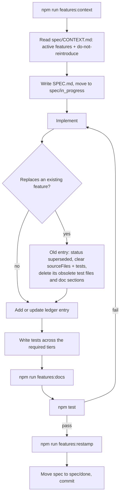

# Feature Ledger

The feature ledger keeps a sequence of agentic runs aware of what the application
actually does *right now*, so that each run starts from an accurate picture of the
codebase instead of re-deriving it from the commit history.

## Why

Specifications in [`spec/`](../spec/) are a record of *intent at a point in time*. They
accumulate: a spec that removed the Tasks UI and a spec that introduced it are equally
present on disk. Reading the spec folder therefore tells an agent what was *ever*
attempted, not what is *currently true*. The ledger adds the missing layer: a single
machine-readable statement of the live feature set.

## Goals it serves

| Goal | Mechanism |
| --- | --- |
| Awareness of implemented features | One ledger entry per feature; agents query the ledger, not the folder tree |
| Only the most up-to-date variant counts | `status` + `supersededBy` chain; context generation filters to `active` |
| Superseded/abandoned work is ignored | `superseded` / `removed` entries keep their rationale but claim no code, no tests |
| Test suite matched to features | Each entry maps tests by tier (`unit`, `integration`, `e2e`) |
| Documentation up to date | [`docs/features.md`](features.md) is generated from the ledger and verified in sync |
| Context for each run | `spec/CONTEXT.md` is a compact digest of active features, regenerated per run |
| Post-run verification | `sourceHash` staleness detection forces re-verification of every touched feature |

## Artifacts

| Path | Committed | Purpose |
| --- | --- | --- |
| [`spec/FEATURES.json`](../spec/FEATURES.json) | yes | The ledger: the source of truth |
| [`docs/features.md`](features.md) | yes | Generated human-readable feature documentation |
| `spec/CONTEXT.md` | no (gitignored) | Generated per-run agent context digest |
| [`scripts/featureLedger.js`](../scripts/featureLedger.js) | yes | Load / hash / restamp helpers |
| [`scripts/verifyFeatures.js`](../scripts/verifyFeatures.js) | yes | Validator, wired into `npm test` |
| [`scripts/featureDocs.js`](../scripts/featureDocs.js) | yes | Documentation and context generator |

## Entry shape

```jsonc
{
  "id": "prompt-overlay",              // stable identity, survives rewrites
  "title": "On-demand centered LLM prompt overlay",
  "summary": "One sentence, used verbatim in generated docs and run context.",
  "status": "active",                  // active | superseded | removed
  "specPath": "spec/done/feat-v9t2ce-overlay-prompt-status-bar/SPEC.md",
  "supersedes": ["prompt-panel"],      // ids this entry replaced
  "supersededBy": null,                // set when this entry is retired
  "removalReason": null,               // required when status is "removed"
  "userVisible": true,
  "sourceFiles": ["js/llmPrompt/promptPanel.js", "css/llmPrompt.css"],
  "tests": { "unit": ["test/promptPanel.test.js"], "integration": [], "e2e": [] },
  "requiredTiers": ["unit"],           // tiers the validator enforces as non-empty
  "sourceHash": "sha256:…",            // hash of sourceFiles at last verification
  "lastVerified": "2026-08-23"
}
```

The `id` is the identity — not the spec folder. When a run rewrites a feature it does
**not** create a second `active` entry: it flips the old entry to `superseded`, empties
its `sourceFiles` and `tests`, and points `supersededBy` at the new id.

## Identity vs. evidence

A spec folder is *evidence* for an entry, not the entry itself. Several specs can
collapse into a single feature over time (the prompt panel went through three specs
before becoming the overlay), and one spec can be the evidence for the *removal* of a
feature (`feat-r8m4zq-remove-tasks-ui` is the evidence for the `tasks-ui` entry being
`removed`). Every `SPEC.md` under `spec/` must be claimed by exactly one entry, which is
what stops specs from silently drifting out of the ledger.

## Staleness detection

`sourceHash` is a SHA-256 over the contents of the entry's `sourceFiles`. The validator
recomputes it; a mismatch means the code backing that feature changed without the feature
being re-verified, and is reported as an error. After a run has changed code and the test
suite is green, the run restamps the affected entries:

```sh
npm run features:restamp -- prompt-overlay nav-breadcrumbs
```

Content hashing is used rather than git commit comparison deliberately: it works in the
uncommitted working tree, so the restamp happens *before* the run's commit rather than
being invalidated by it.

## Run lifecycle



## Validator rules

`npm run verify:features` enforces:

1. **Schema** — required fields present, `status` within the enum, tier keys well formed.
2. **Unique identity** — no duplicate `id`, no duplicate `specPath`.
3. **Referential integrity** — every `specPath`, source file and test file exists on disk.
4. **Orphan detection** — every `SPEC.md` under `spec/` is claimed by exactly one entry;
   every `test/**/*.test.js` is claimed by at least one `active` entry.
5. **Supersession consistency** — `supersededBy` targets exist, `supersedes` is the exact
   inverse relation, `active` entries are never superseded, and the chain has no cycles.
6. **Retired entries claim nothing** — `superseded` and `removed` entries must have empty
   `sourceFiles` and empty test tiers, and their former test files must no longer exist.
   This is what prevents the suite from accumulating tests for deliberately dropped
   behaviour.
7. **Tier coverage** — every tier listed in `requiredTiers` must resolve to at least one
   existing test file.
8. **Staleness** — recomputed `sourceHash` must match the recorded one.
9. **Documentation sync** — `docs/features.md` must match what the generator produces.

Warnings (promoted to errors with `--strict`) cover coverage debt: an `active` feature
with no tests at all, and a `userVisible` feature with no `e2e` tier. The repository
currently carries such debt intentionally — there is no end-to-end tier yet — so warnings
are the migration path rather than a permanent state.

## Commands

| Command | Effect |
| --- | --- |
| `npm run verify:features` | Validate the ledger (also part of `npm test`) |
| `npm run verify:features -- --strict` | Treat coverage warnings as failures |
| `npm run features:context` | Regenerate `spec/CONTEXT.md` for the next run |
| `npm run features:docs` | Regenerate `docs/features.md` |
| `npm run features:restamp -- <id> [...]` | Re-hash entries after verifying them |
| `npm run features:restamp -- --all` | Re-hash every active entry |

## Known failure modes

- **Ledger drift** — a ledger nobody validates rots within three runs. The validator
  running inside `npm test` is the only thing preventing this; keep it there.
- **Identity churn** — an agent invents a new `id` for what is really a revision of an
  existing feature, producing two `active` entries for one behaviour. The context digest
  lists ids prominently to make the existing identity easy to find and reuse.
- **Test theatre** — tests that assert the implementation rather than the spec's
  acceptance criteria. Reference acceptance criteria from the tests to keep them anchored
  to intent.
