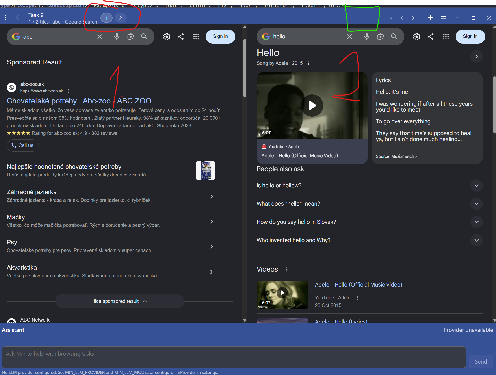
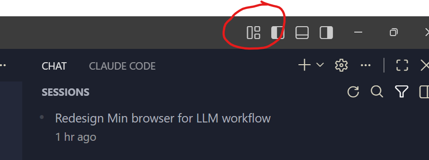

# Feature Specification

## 1. Feature Title
- **Feature name:** Multi-tile tab strip with compact icon-title tabs and layout switcher
- **Created on:** 2026-08-09 16:14:06 +02:00
- **Owner:** Jozef Košík <jozef.kosik@radixal.net>

## 2. Summary
Provide a concise overview of the feature and why it matters.

- **Problem statement:** In multi-tile mode, the current top bar shows numeric tile indicators (for example 1 and 2), which does not scale well for larger browsing sessions and does not match standard browser tab discoverability.
- **Desired outcome:** Replace numeric indicators with compact standard tab items (icon + title), introduce a right-tapering/overflow behavior for large tab counts, and add a layout switcher in the top-right bar area to choose between predefined tile layouts.

## 3. Background and Context
Describe the context, current limitations, and any related work.

- **Current behavior:** The shown layout uses numeric tile markers and no VS Code-like layout switcher in the highlighted top-right zone.
- **Motivation:** The fork is moving toward LLM-driven workflows while keeping a minimal browser feel. Users need standard visual tab recognition and fast tile layout switching for side-by-side context.
- **Related issues or references:**
  - Screenshot reference A: `pasted-image-1.png` (two-tile layout, red marks for tab indicators and desired switcher area).
  - Screenshot reference B: `pasted-image-2.png` (VS Code-like layout switcher inspiration).
  - Source attachment URL A: https://github.com/github-copilot/chat/attachments/e21f96ed-3d91-49fc-b41c-bfb17ea46b12
  - Source attachment URL B: https://github.com/github-copilot/chat/attachments/900f0566-e0d1-431f-b164-2a0400df0298

## 4. Goals
List the primary outcomes this feature should achieve.

- Goal 1: Replace numeric tile indicators with compact tab items using favicon + page title (for both displayed and currently undisplayed pages in the session list).
- Goal 2: Implement a scalable tab strip behavior where tab items remain small and the list naturally tapers/overflows to the right when many pages are present.
- Goal 3: Add a top-bar layout switcher (in the highlighted green-zone area) with presets for 1 tile, 2 horizontal tiles, 2 vertical tiles, and 2x2 grid (4 tiles), and populate selected layout with first N pages from the global ordered list.

## 5. Non-Goals
List what is explicitly out of scope for this feature.

- Non-goal 1: Implementing LLM prompt routing like `go @google.com` with deterministic IntelliSense-style recall of visited pages.
- Non-goal 2: Reworking the entire navigation, session restore, or task model beyond what is required for tab strip display and layout selection.

## 6. User Stories
Capture the expected user experience.

- As a browsing user, I want each tab indicator to show recognizable icon-title information so that I can identify pages quickly without relying on numeric labels.
- As a power user with many open pages, I want compact tabs and overflow behavior so that the interface stays usable instead of trying to fit everything.
- As a user comparing content, I want a one-click layout switcher so that I can quickly switch between one-tile and multi-tile views.

## 7. Functional Requirements
Define the expected behavior in clear, testable terms.

1. Requirement 1: The tile/tab strip MUST render tab items as `favicon + title` in place of numeric indicators.
2. Requirement 2: The tab strip MUST support sessions with many pages by preserving small tab item widths and tapering/overflowing to the right rather than resizing to unreadable sizes.
3. Requirement 3: The top-right bar region MUST include a layout switcher control with at least these options: single tile, two horizontal tiles, two vertical tiles, four-tile grid.
4. Requirement 4: When a layout with N tiles is selected, tiles MUST be populated deterministically from the first N entries in the global page list order.
5. Requirement 5: Existing single-tile default behavior MUST remain available and usable as the normal mode.

## 8. Non-Functional Requirements
Capture quality and system constraints.

- Performance: Layout switches should feel immediate under normal desktop usage and avoid full-window jank.
- Reliability: Switching layout should not lose tab/page state; failures should fall back to single-tile layout safely.
- Security: No new privileged capabilities; preserve existing navigation and permission boundaries.
- Accessibility: Controls should be keyboard reachable and expose meaningful labels for tab titles and layout options.
- Compatibility: Behavior should work on Windows/macOS/Linux builds supported by this repository.

## 9. UX / UI Notes
Describe any interface expectations or user interaction details.

- User flow: User opens pages, sees compact icon-title tabs, and uses top-right layout switcher to choose view topology.
- Visual considerations: Keep tab indicators reasonably small, visually standard, and consistent with existing Min style; avoid overcrowding by right-side taper/overflow.
- Edge cases: Missing favicons should show fallback icon; very long titles should truncate with ellipsis; selecting 4-tile layout with <4 pages should show empty/safe placeholders for missing slots.

## 10. Technical Notes
Capture implementation guidance, architecture, and dependencies.

- Proposed approach:
  - Replace numeric indicator render path with tab metadata render path (title + icon).
  - Add deterministic global page list source for layout population order.
  - Add layout-switcher component in top-right bar and wire it to existing tile layout manager.
  - Reuse existing CSS primitives where possible; add focused styles for compact tab strip and overflow behavior.
- Dependencies: Existing tab state, browser UI top bar components, and layout manager modules.
- Risks / unknowns:
  - Potential interaction conflicts with current task-based tab grouping behavior.
  - Ambiguity around expected taper mechanics (scroll, fade, clip, or mixed) and keyboard semantics.
- Open questions:
  - Should right-side taper be implemented as horizontal scroll, fade-out gradient, hard clipping, or a combined pattern?
  - Should inactive undisplayed pages still be reorderable from this strip in this phase, or read-only?

## 11. Acceptance Criteria
Define how success will be measured.

- [ ] Numeric tile markers are replaced with compact icon-title tab indicators.
- [ ] Tab strip remains usable with large page counts and tapers/overflows to the right without trying to fit all items.
- [ ] Layout switcher appears in the intended top-right bar area and supports at least 1, 2H, 2V, and 4-tile layouts.
- [ ] Selecting a layout populates tiles with the first N pages from global list order deterministically.
- [ ] Single-tile browsing remains the default and behaves as before.

## 12. Testing / Verification
Describe how the feature will be validated.

- Manual test plan:
  - Open 20+ pages and verify compact icon-title strip behavior and overflow/taper.
  - Switch across all layout presets and verify deterministic first-N page population.
  - Verify keyboard focus and activation for layout switcher controls.
  - Verify fallback icon and title truncation behavior.
- Automated test coverage:
  - Unit tests for global page list ordering and first-N tile assignment.
  - UI/component tests for layout option rendering and selection state.
- Regression considerations:
  - Existing single-tile flow, tab switching, and task/group interactions.

## 13. Rollout / Follow-up
Note any rollout considerations or future enhancements.

- Rollout plan: Ship behind an optional feature flag if needed, then enable by default after smoke validation.
- Follow-up work:
  - LLM command flow (`go @address`) with deterministic IntelliSense recall of visited pages.
  - Advanced overflow ergonomics (pinning, scrolling affordance, quick search in tabs).

## 14. Mockups / References
The images below are expected to be stored next to this file.

- Primary annotated target state:

- Layout switcher inspiration:

